# Career Discovery Chatbot - Conversational Flow Documentation

This document provides a detailed visual representation of the conversational flow implemented in the Career Discovery Chatbot system.

## Complete Conversational Flow

```mermaid
flowchart TD
    %% Start Flow
    A[👋 Welcome Screen] --> B{User Ready?}
    B -->|Yes| C[📝 Context Check]
    B -->|Maybe Later| Z[💭 End Session]
    
    %% Context Check Stage
    C --> D{Select Stage}
    D -->|Student| E[🎓 Student Path]
    D -->|College Student| F[📚 College Path]
    D -->|Professional| G[💼 Professional Path]
    D -->|Career Switcher| H[🔄 Switcher Path]
    
    %% Interest Exploration Stage
    E --> I[🔍 Interest Exploration]
    F --> I
    G --> I
    H --> I
    
    I --> J{Input Method}
    J -->|Categories| K[📊 Category Selection]
    J -->|Freeform| L[✍️ Text Input]
    J -->|Both| M[🔗 Combined Input]
    
    %% LLM Analysis Stage
    K --> N[🧠 LLM Analysis]
    L --> N
    M --> N
    
    N --> O{LLM Available?}
    O -->|Yes| P[⚡ AI Processing]
    O -->|No| Q[🔄 Fallback Analysis]
    
    %% Preference Extraction
    P --> R[📋 Preference Extraction]
    R --> S[🎯 Interest Analysis]
    R --> T[🛠️ Skill Assessment]
    R --> U[💎 Value Identification]
    
    %% Confidence Assessment
    S --> V{Confidence Check}
    T --> V
    U --> V
    
    V -->|High| W[✅ High Confidence]
    V -->|Medium| X[⚠️ Medium Confidence]
    V -->|Low| Y[❓ Low Confidence]
    
    %% Career Matching
    W --> AA[🎯 Career Matching]
    X --> AA
    Y --> BB[❓ Clarifying Questions]
    
    BB --> I
    Q --> AA
    
    %% Career Recommendation Engine
    AA --> CC{Matching Method}
    CC -->|LLM Mapping| DD[🤖 AI Career Mapping]
    CC -->|Vector Search| EE[🔍 Semantic Search]
    
    DD --> FF[📊 Domain Analysis]
    FF --> GG{Career Domain}
    GG -->|STEM| HH[💻 STEM Careers]
    GG -->|Arts| II[🎨 Creative Careers]
    GG -->|Sports| JJ[⚽ Sports Careers]
    GG -->|General| KK[🌐 General Careers]
    
    %% Vector Search Path
    EE --> LL[🔢 Embedding Generation]
    LL --> MM[📏 Similarity Calculation]
    MM --> NN[🎯 Top Matches]
    
    %% Results Convergence
    HH --> OO[📋 Career Results]
    II --> OO
    JJ --> OO
    KK --> OO
    NN --> OO
    
    %% Results Evaluation
    OO --> PP{Results Found?}
    PP -->|Yes| QQ[✅ Display Careers]
    PP -->|No| RR[🔄 Refine Search]
    
    RR --> BB
    
    %% Career Detail Exploration
    QQ --> SS[📖 Career Details]
    SS --> TT{User Action}
    TT -->|View Details| UU[📊 Detailed View]
    TT -->|Explore More| VV[🔍 More Careers]
    TT -->|Get Report| WW[📄 PDF Generation]
    TT -->|Next Steps| XX[🚀 Action Planning]
    
    %% Detailed Career View
    UU --> YY[👤 Personalized Explanation]
    UU --> ZZ[🛠️ Skills Breakdown]
    UU --> AAA[🎓 Education Requirements]
    UU --> BBB[💰 Salary Information]
    UU --> CCC[🏢 Companies & Opportunities]
    UU --> DDD[📈 Career Progression]
    UU --> EEE[🎯 Personality Match]
    
    %% User Actions from Detail View
    YY --> FFF{Next Action}
    ZZ --> FFF
    AAA --> FFF
    BBB --> FFF
    CCC --> FFF
    DDD --> FFF
    EEE --> FFF
    
    FFF -->|Back to List| VV
    FFF -->|New Search| I
    FFF -->|Get PDF| WW
    FFF -->|Next Steps| XX
    
    %% More Careers Exploration
    VV --> GGG[📊 Alternative Careers]
    GGG --> QQ
    
    %% PDF Report Generation
    WW --> HHH[📝 Generate Summary]
    HHH --> III[📋 Action Items]
    III --> JJJ[📊 Career Comparison]
    JJJ --> KKK[📄 Download PDF]
    KKK --> XX
    
    %% Next Steps & Action Planning
    XX --> LLL[🎯 Immediate Actions]
    XX --> MMM[📚 Learning Resources]
    XX --> NNN[⏰ Timeline Planning]
    XX --> OOO[🔗 External Links]
    
    %% Final Actions
    LLL --> PPP{Continue?}
    MMM --> PPP
    NNN --> PPP
    OOO --> PPP
    
    PPP -->|Explore More| I
    PPP -->|Start Over| A
    PPP -->|End Session| QQQ[✨ Success End]
    
    %% End States
    Z --> RRR[😴 Session Paused]
    QQQ --> SSS[🎉 Goals Achieved]
    
    %% Progress Tracking (Side annotations)
    A -.-> T1[Step 1/9]
    C -.-> T2[Step 2/9]
    I -.-> T3[Step 3/9]
    N -.-> T4[Step 4/9]
    AA -.-> T5[Step 5/9]
    QQ -.-> T6[Step 6/9]
    UU -.-> T7[Step 7/9]
    XX -.-> T8[Step 8/9]
    QQQ -.-> T9[Step 9/9]
    
    %% Styling
    classDef startEnd fill:#e1f5fe,stroke:#01579b,stroke-width:3px
    classDef process fill:#f3e5f5,stroke:#4a148c,stroke-width:2px
    classDef decision fill:#fff3e0,stroke:#e65100,stroke-width:2px
    classDef llm fill:#e8f5e8,stroke:#1b5e20,stroke-width:2px
    classDef result fill:#fff9c4,stroke:#f57f17,stroke-width:2px
    classDef progress fill:#fce4ec,stroke:#880e4f,stroke-width:1px
    
    class A,QQQ,SSS startEnd
    class C,I,N,AA,UU,XX process
    class B,D,J,O,V,CC,GG,PP,TT,FFF,PPP decision
    class P,R,S,T,U,DD,FF llm
    class QQ,OO,WW result
    class T1,T2,T3,T4,T5,T6,T7,T8,T9 progress
```



## Stage-by-Stage Breakdown

### Stage 1: Welcome & Introduction (Step 1/9)

**Purpose**: Create engagement and set expectations
**Duration**: 30-60 seconds
**Components**:
- AI persona introduction ("Brainy")
- Value proposition explanation
- Progress indicator initialization
- User commitment check

**UI Elements**:
```
┌─────────────────────────────────────┐
│ 👋 Hey there! I'm Brainy, your     │
│    AI Career Guide                  │
│                                     │
│ I'll help you uncover paths that    │
│ match your passions, skills, and    │
│ dreams.                             │
│                                     │
│ Progress: ████░░░░░ 0/9 Steps       │
│                                     │
│ [Yes, let's explore!] [Maybe later] │
└─────────────────────────────────────┘
```

### Stage 2: Context & Confidence Check (Step 2/9)

**Purpose**: Personalize questioning approach
**Duration**: 1-2 minutes
**User Segments**:
- **School Student**: Focus on interests and exploration
- **College Student**: Include academic alignment
- **Working Professional**: Consider experience and skills
- **Career Switcher**: Address transition concerns

**Adaptive Questioning Logic**:
```python
def get_questions_for_stage(user_stage):
    if user_stage == "School Student":
        return ["What subjects interest you most?", 
                "What activities make you excited?"]
    elif user_stage == "College Student":
        return ["What's your major?", 
                "What career outcomes do you hope for?"]
    # ... additional logic
```

### Stage 3: Interest Exploration (Step 3/9)

**Purpose**: Capture comprehensive user preferences
**Duration**: 2-4 minutes
**Input Methods**:

#### 3A: Category Selection
**Available Categories** (8 primary):
- 💻 Technology & Innovation
- 🏥 Healthcare & Medicine  
- 💼 Business & Entrepreneurship
- 🎨 Creative Arts & Design
- 🏫 Education & Teaching
- 🔬 Science & Research
- ⚽ Sports & Fitness
- 🌍 Social Impact & Service

#### 3B: Freeform Input
**Prompt Examples**:
- "Describe your ideal work environment"
- "What problems do you enjoy solving?"
- "What activities energize you?"

#### 3C: Combined Approach
- Multi-select categories + detailed text
- Weighted preference system
- Conflict resolution for mixed inputs

### Stage 4: LLM-Powered Analysis (Step 4/9)

**Purpose**: Extract structured insights from user input
**Duration**: 15-30 seconds (processing)
**Analysis Components**:

#### 4A: Preference Extraction Pipeline


#### 4B: LLM Prompt Categories
1. **Interest Extraction** (`prompts/preference_extraction/interest_extraction.txt`)
2. **Skill Assessment** (`prompts/preference_extraction/skill_assessment.txt`)
3. **Values Identification** (`prompts/preference_extraction/values_identification.txt`)

#### 4C: Output Structure
```json
{
    "primary_interests": ["technology", "problem-solving", "creativity"],
    "secondary_interests": ["teamwork", "innovation"],
    "skills": {
        "technical": ["programming", "analysis"],
        "soft": ["communication", "leadership"]
    },
    "values": ["work-life balance", "growth", "impact"],
    "confidence_level": "high",
    "missing_info": [],
    "personality_traits": ["analytical", "creative"]
}
```

### Stage 5: Career Matching Engine (Step 5/9)

**Purpose**: Generate personalized career recommendations
**Duration**: 1-3 seconds
**Matching Strategies**:

#### 5A: LLM-Based Career Mapping


#### 5B: Vector Search Fallback
```python
def vector_search_careers(self, preferences):
    # Generate search query from preferences
    query = " ".join(preferences['primary_interests'] + 
                    preferences['skills']['technical'])
    
    # Semantic search in ChromaDB
    results = self.collection.query(
        query_texts=[query],
        n_results=10
    )
    return results
```

#### 5C: Hybrid Scoring System
- **Interest Alignment**: 40%
- **Skill Match**: 30%  
- **Value Compatibility**: 20%
- **Growth Potential**: 10%

### Stage 6: Career Recommendations Display (Step 6/9)

**Purpose**: Present relevant career options
**Duration**: 2-5 minutes (browsing)
**Display Components**:

#### 6A: Career Card Layout
```
┌─────────────────────────────────────┐
│ 💻 Frontend Developer               │
│ ✨ Perfect Match: 94%               │
│                                     │
│ Create user-facing web applications │
│ using modern frameworks...          │
│                                     │
│ 🎯 Why this matches you:            │
│ Your interest in technology and     │
│ creative problem-solving aligns...  │
│                                     │
│ [View Details] [Save] [Not for me] │
└─────────────────────────────────────┘
```

#### 6B: Recommendation Algorithm
```python
def rank_careers(self, user_preferences, career_candidates):
    scored_careers = []
    for career in career_candidates:
        score = (
            self.calculate_interest_match(user_preferences, career) * 0.4 +
            self.calculate_skill_match(user_preferences, career) * 0.3 +
            self.calculate_value_match(user_preferences, career) * 0.2 +
            self.calculate_growth_potential(career) * 0.1
        )
        scored_careers.append((career, score))
    return sorted(scored_careers, key=lambda x: x[1], reverse=True)
```

### Stage 7: Detailed Career Exploration (Step 7/9)

**Purpose**: Provide comprehensive career insights
**Duration**: 3-8 minutes per career
**Information Architecture**:

#### 7A: Career Detail Components
1. **Personalized Explanation** (LLM-generated)
2. **Skills Breakdown** (Required vs. Preferred)
3. **Education Pathways** (Multiple routes)
4. **Compensation Analysis** (Range + factors)
5. **Industry Landscape** (Top companies + trends)
6. **Career Progression** (Typical advancement path)
7. **Day-in-the-Life** (Work environment + responsibilities)
8. **Success Metrics** (How performance is measured)

#### 7B: Interactive Elements
```
┌─────────────────────────────────────┐
│ 🛠️ Key Skills                      │
│ ┌─────────────────────────────────┐ │
│ │ ✅ JavaScript  ⭐⭐⭐⭐⭐     │ │
│ │ ✅ React       ⭐⭐⭐⭐⭐     │ │
│ │ ⚠️  TypeScript ⭐⭐⭐⭐⚪     │ │
│ │ ❌ Node.js     ⭐⭐⭐⚪⚪     │ │
│ └─────────────────────────────────┘ │
│                                     │
│ [Skill Learning Path] [Assess Me]   │
└─────────────────────────────────────┘
```

### Stage 8: Next Steps & Action Planning (Step 8/9)

**Purpose**: Provide actionable guidance
**Duration**: 3-5 minutes
**Action Categories**:

#### 8A: Immediate Actions (Next 30 days)
- Skill assessments to take
- Online courses to start
- People to connect with
- Books/resources to explore

#### 8B: Short-term Goals (Next 3-6 months)
- Certifications to pursue
- Projects to build
- Experience to gain
- Network to develop

#### 8C: Long-term Vision (6 months - 2 years)
- Educational milestones
- Career transitions
- Portfolio development
- Professional positioning

#### 8D: Resource Integration
```python
def generate_action_plan(self, career, user_profile):
    return {
        "immediate": self.get_immediate_actions(career, user_profile),
        "short_term": self.get_short_term_goals(career, user_profile),
        "long_term": self.get_long_term_vision(career, user_profile),
        "resources": self.get_learning_resources(career),
        "timeline": self.create_timeline(career, user_profile)
    }
```

### Stage 9: Report Generation & Follow-up (Step 9/9)

**Purpose**: Provide comprehensive summary and next steps
**Duration**: 2-3 minutes
**Report Components**:

#### 9A: PDF Report Structure
1. **Executive Summary**
   - Top 3 career recommendations
   - Match percentages and reasoning
   - Key insights about user preferences

2. **Detailed Career Profiles**
   - Complete information for each recommended career
   - Personalized explanations
   - Action plans and timelines

3. **Learning Roadmap**
   - Skill development priorities
   - Recommended courses and certifications
   - Timeline and milestones

4. **Resource Directory**
   - Educational platforms
   - Professional organizations
   - Networking opportunities
   - Job search resources

#### 9B: Follow-up Mechanisms
- Email summary with key insights
- Calendar reminders for action items
- Progress tracking for skill development
- Periodic check-ins and updates

## Error Handling & Fallback Flows

### Fallback Strategy 1: LLM Unavailable


### Fallback Strategy 2: Low Confidence Results


### Fallback Strategy 3: No Career Matches


## Conversation State Management

### Session State Schema
```python
class ConversationState:
    current_stage: str  # Current flow position
    progress_step: int  # Progress indicator (1-9)
    user_data: Dict     # Collected user information
    recommendations: List[Dict]  # Generated career recommendations
    selected_career: str  # Currently viewed career
    conversation_history: List[Dict]  # Full interaction log
    fallback_count: int  # Number of fallback attempts
    confidence_score: float  # Overall confidence in recommendations
```

### State Transitions
```python
FLOW_TRANSITIONS = {
    'welcome': ['context_check', 'end_session'],
    'context_check': ['interest_exploration'],
    'interest_exploration': ['llm_analysis'],
    'llm_analysis': ['career_matching', 'clarifying_questions'],
    'career_matching': ['recommendations', 'refine_search'],
    'recommendations': ['career_details', 'new_search'],
    'career_details': ['action_planning', 'more_careers', 'pdf_report'],
    'action_planning': ['end_success', 'restart', 'explore_more'],
    'clarifying_questions': ['interest_exploration'],
    'refine_search': ['interest_exploration', 'career_matching']
}
```

This comprehensive conversational flow ensures users receive personalized, actionable career guidance through an intelligent, adaptive system that can handle various scenarios and provide fallback options when needed.
