# 🚀 Career Discovery Chatbot - Complete Documentation

An intelligent AI-powered career guidance system that helps users discover personalized career paths through interactive conversations.

## 📋 Table of Contents

- [Project Overview](#-project-overview)
- [Features](#features)
- [System Architecture](#-system-architecture)
- [Installation & Setup](#-installation--setup)
- [How It Works](#-how-it-works)
- [Conversational Flow](#-detailed-conversational-flow)
- [Technical Implementation](#-technical-implementation)
- [API Reference](#-api-reference)
- [Project Structure](#-project-structure)
- [Contributing](#-contributing)

## 🌟 Project Overview

The Career Discovery Chatbot is an intelligent, AI-powered system designed to help users discover suitable career paths through interactive conversations. The system leverages advanced language models, vector databases, and prompt engineering to provide personalized career recommendations.

### Key Features

- 🤖 **Intelligent Conversations**: AI-powered multi-stage dialog for preference discovery
- 🎯 **Personalized Recommendations**: Vector-based career matching with 109+ career options
- 🧠 **LLM Integration**: Advanced language models for preference extraction and explanations
- 📊 **Rich Career Insights**: Detailed information on skills, education, salary, and career paths
- 🎨 **Modern UI**: Interactive Streamlit interface with progress tracking
- 📈 **Real-time Analysis**: Instant preference extraction and career mapping

### Technology Stack

- **Frontend**: Streamlit (Python web framework)
- **Backend**: Python 3.12+
- **Vector Database**: ChromaDB with persistent storage
- **LLM Integration**: Groq API with Mixtral models
- **Embedding Model**: Sentence Transformers (all-MiniLM-L6-v2)
- **Data Processing**: Pandas, NumPy
- **Prompt Management**: Template-based system with modular prompts

## 🏗️ System Architecture

### High-Level Architecture

```
┌─────────────────┐    ┌─────────────────┐    ┌─────────────────┐
│   Streamlit UI  │───▶│  Core Engine    │───▶│   Data Layer    │
│                 │    │                 │    │                 │
│ • Chat Interface│    │ • Flow Manager  │    │ • ChromaDB      │
│ • Career Cards  │    │ • LLM Manager   │    │ • Career Data   │
│ • Progress UI   │    │ • AI Counselor  │    │ • Embeddings    │
└─────────────────┘    └─────────────────┘    └─────────────────┘
```

### Component Architecture

**Frontend Layer (Streamlit UI)**
- `components/chat_interface.py`: Main conversation interface
- `components/career_cards.py`: Career recommendation display
- `components/option_selector.py`: User input selection components

**Core Business Logic**
- `core/career_counselor.py`: Main orchestration and career matching
- `core/llm_manager.py`: Language model integration and prompt handling
- `core/flow_manager.py`: Conversation state management
- `core/chroma_manager.py`: Vector database operations

**Data Layer**
- `data/career_data.json`: 109 comprehensive career profiles
- `data/career_embeddings.py`: Vector embedding generation
- `prompts/`: Specialized AI prompts for different conversation stages

## 🚀 Installation & Setup

### Prerequisites

- Python 3.12 or higher
- 4GB RAM minimum
- Internet connection for API calls

### Quick Start

1. **Clone the repository**
    ```bash
    git clone <repository_url>
    cd career_chatbot
    ```

2. **Create virtual environment**
    ```bash
    python -m venv venv
    source venv/bin/activate  # On Windows: venv\Scripts\activate
    ```

3. **Install dependencies**
    ```bash
    pip install -r requirements.txt
    ```

4. **Set up environment variables**
    Create a `.env` file:
    ```
    GROQ_API_KEY=your_groq_api_key_here
    EMBEDDING_MODEL=all-MiniLM-L6-v2
    ```

5. **Initialize the database**
    ```bash
    python setup.py
    ```

6. **Run the application**
    ```bash
    export TOKENIZERS_PARALLELISM=false
    export OMP_NUM_THREADS=1
    streamlit run app.py
    ```

7. **Open your browser**
    Navigate to http://localhost:8501

## 🎯 How It Works

### Conversation Flow Overview

The chatbot guides users through a comprehensive 9-step discovery process:

1. **Welcome & Introduction** 👋
    - Meet Brainy, your AI career guide
    - Set expectations and goals

2. **Context Check** 📝
    - Identify user's current stage (Student, Professional, Career Switcher)
    - Tailor questions accordingly

3. **Interest Exploration** 🔍
    - Select from 8+ interest categories
    - Provide detailed freeform descriptions
    - Combine structured and unstructured input

4. **AI Analysis** 🧠
    - LLM-powered preference extraction
    - Advanced prompt engineering for accurate insights
    - Confidence scoring for recommendations

5. **Skill Assessment** 🛠️
    - Technical skills evaluation
    - Soft skills identification
    - Learning preferences analysis

6. **Values Identification** 💎
    - Work-life balance preferences
    - Career motivation factors
    - Professional values alignment

7. **Career Mapping** 🗺️
    - Vector-based career matching
    - Similarity scoring across 109+ careers
    - Domain-specific recommendations

8. **Personalized Recommendations** 📋
    - Top 5-10 career suggestions
    - Detailed explanations for each match
    - Learning pathways and next steps

9. **Next Steps Planning** 📅
    - Skill development roadmap
    - Educational requirements
    - Industry insights and job market trends

## 🔄 Detailed Conversational Flow

```mermaid
flowchart TD
     %% Start Flow
     A[👋 Welcome Screen] --> B{User Ready?}
     B -->|Yes| C[📝 Context Check]
     B -->|Maybe Later| Z[💭 End Session]
     
     %% Context Check Stage
     C --> D{Select Stage}
     D -->|Student| E[🎓 Student Path]
     D -->|College Student| F[📚 College Path]
     D -->|Professional| G[💼 Professional Path]
     D -->|Career Switcher| H[🔄 Switcher Path]
     
     %% Interest Exploration Stage
     E --> I[🔍 Interest Exploration]
     F --> I
     G --> I
     H --> I
     
     I --> J{Input Method}
     J -->|Categories| K[📊 Category Selection]
     J -->|Freeform| L[✍️ Text Input]
     J -->|Both| M[🔗 Combined Input]
     
     %% LLM Analysis Stage
     K --> N[🧠 LLM Analysis]
     L --> N
     M --> N
     
     N --> O{LLM Available?}
     O -->|Yes| P[⚡ AI Processing]
     O -->|No| Q[🔄 Fallback Analysis]
     
     %% Preference Extraction
     P --> R[📋 Preference Extraction]
     R --> S[🎯 Interest Analysis]
     R --> T[🛠️ Skill Assessment]
     R --> U[💎 Value Identification]
     
     %% Confidence Assessment
     S --> V{Confidence Check}
     T --> V
     U --> V
     
     V -->|High Confidence| W[🎯 Direct Recommendations]
     V -->|Medium Confidence| X[❓ Clarifying Questions]
     V -->|Low Confidence| Y[🔄 Re-exploration]
     
     %% Career Matching
     W --> AA[🔍 Vector Search]
     X --> AA
     Y --> I
     
     AA --> BB[📊 Similarity Scoring]
     BB --> CC[🎯 Top Matches]
     CC --> DD[💡 Explanation Generation]
     
     %% Results and Recommendations
     DD --> EE[📋 Career Recommendations]
     EE --> FF{User Satisfied?}
     FF -->|Yes| GG[📅 Next Steps Planning]
     FF -->|No| HH[🔄 Refinement]
     FF -->|Explore More| II[🔍 Additional Searches]
     
     %% Final Outcomes
     GG --> JJ[✅ Success: Action Plan]
     HH --> I
     II --> AA
     
     %% Error Handling
     Q --> KK[❓ Clarifying Questions]
     KK --> I
     
     style A fill:#e1f5fe
     style JJ fill:#c8e6c9
     style Z fill:#ffcdd2
```



### Conversation Stages Explained

#### 1. Onboarding Stage
- **Purpose**: Welcome users and set expectations
- **Components**: 
  - Introduction to Brainy (AI counselor)
  - Explanation of the process
  - Privacy and data usage information
- **User Actions**: Ready to start vs. maybe later
- **Duration**: 1-2 minutes

#### 2. Context Assessment
- **Purpose**: Understand user's current life stage and goals
- **Categories**:
  - Student: High school or early college
  - College Student: Later college years, internship seeking
  - Professional: Currently employed, seeking advancement
  - Career Switcher: Looking to change fields entirely
- **Customization**: Questions and recommendations tailored to each path

#### 3. Interest Exploration
**Multi-Modal Input**:
- Category Selection: Choose from predefined interest areas
- Freeform Text: Describe interests in natural language
- Combined Approach: Mix of structured and unstructured input

**Interest Categories**:
- 🎨 Creative & Artistic
- 📊 Analytical & Data-Driven  
- 👥 Social & People-Focused
- 🏃 Physical & Active
- 💻 Technical & Engineering
- 💼 Business & Entrepreneurial
- 🏥 Healthcare & Helping
- 📚 Educational & Research

#### 4. AI-Powered Analysis
- **LLM Processing**: Advanced prompt engineering for preference extraction
- **Multi-Stage Analysis**:
  - Interest Extraction (`prompts/preference_extraction/interest_extraction.txt`)
  - Skill Assessment (`prompts/preference_extraction/skill_assessment.txt`)
  - Values Identification (`prompts/preference_extraction/values_identification.txt`)

#### 5. Career Mapping & Recommendations
- **Vector Search**: Semantic similarity using ChromaDB
- **Domain-Specific Prompts**:
  - STEM careers (`prompts/career_mapping/stem_careers.txt`)
  - Arts careers (`prompts/career_mapping/arts_careers.txt`)
  - Sports careers (`prompts/career_mapping/sports_careers.txt`)
  - General mapping (`prompts/career_mapping/general_mapping.txt`)

## 🛠️ Technical Implementation

### Core Components

#### 1. LLM Manager (`core/llm_manager.py`)
**Purpose**: Manages multiple LLM providers and specialized prompts

**Key Methods**:
```python
class LLMManager:
     def extract_preferences(conversation_history, analysis_type):
          pass
     def map_to_career_categories(user_preferences, category):
          pass
     def generate_career_explanation(career_name, user_profile, match_score):
          pass
     def generate_clarifying_questions(user_response, missing_info):
          pass
```

**Prompt Template System**:
- Dynamic Loading: Templates loaded from `prompts/` directory
- Context Formatting: User data injected into templates
- Error Handling: Graceful fallbacks for missing templates

#### 2. Chroma Manager (`core/chroma_manager.py`)
**Purpose**: Vector database operations and similarity search

**Key Features**:
- Persistent Storage: Local ChromaDB with automatic initialization
- Metadata Management: Career attributes stored as searchable metadata
- Similarity Search: Cosine similarity for career matching
- Error Recovery: Robust error handling for database operations

```python
class ChromaManager:
     def get_or_create_collection():
          pass
     def search_careers(query_text, top_k=5):
          pass
     def add_career_data(career_documents, metadata, ids):
          pass
```

#### 3. Career Counselor (`core/career_counselor.py`)
**Purpose**: Main orchestration class combining LLM and vector search

**Architecture**:
```python
class CareerCounselor:
     def __init__(self):
          self.groq_client = Groq(api_key=os.getenv("GROQ_API_KEY"))
          self.chroma_manager = ChromaManager()
          self.llm_manager = LLMManager()
          
     def search_career_data(query, top_k=5):
          pass
     def generate_contextual_response(user_input, context, flow_stage):
          pass
     def populate_career_database(career_data_list):
          pass
```

### Data Architecture

#### Career Database Schema
Each of the 109 careers contains:
```json
{
     "id": "unique_career_identifier",
     "title": "Career Title",
     "description": "Detailed career description",
     "industry": "Primary industry category",
     "skills": ["skill1", "skill2", "skill3"],
     "education": ["education_path1", "education_path2"],
     "salary_range": "$XX,XXX - $XXX,XXX",
     "job_outlook": "Demand level description",
     "personality_match": ["trait1", "trait2"],
     "companies": ["company1", "company2"],
     "career_paths": ["progression_step1", "progression_step2"],
     "tagline": "Brief motivational tagline",
     "emoji": "🔬"
}
```

#### Vector Embeddings
**Embedding Strategy**:
- Text Composition: title + description + skills + industry
- Model: all-MiniLM-L6-v2 (384-dimensional embeddings)
- Metadata Storage: All career attributes stored for filtering
- Search Optimization: Cosine similarity with distance thresholding

## 📡 API Reference

### Core API Endpoints

#### LLM Manager API

**Preference Extraction**
```python
def extract_preferences(conversation_history: str, analysis_type: str) -> Dict[str, Any]:
     pass
```
- **Parameters**: 
  - `conversation_history`: Full conversation text
  - `analysis_type`: "interests", "skills", or "values"
- **Returns**: JSON object with extracted preferences
- **Used by**: Chat interface for AI analysis

**Career Mapping**
```python
def map_to_career_categories(user_preferences: Dict, category: str) -> Dict[str, Any]:
     pass
```
- **Parameters**: 
  - `user_preferences`: Extracted preferences object
  - `category`: "stem", "arts", "sports", or "general"
- **Returns**: Career recommendations with reasoning
- **Used by**: Recommendation generation

**Explanation Generation**
```python
def generate_career_explanation(career_name: str, user_profile: Dict, 
                                         match_score: float, user_stage: str) -> str:
     pass
```
- **Parameters**: Career details and user context
- **Returns**: Personalized explanation text
- **Used by**: Career card generation

#### Chroma Manager API

**Career Search**
```python
def search_careers(query_text: str, top_k: int = 5) -> List[Dict]:
     pass
```
- **Parameters**: 
  - `query_text`: Search query (natural language)
  - `top_k`: Number of results to return
- **Returns**: List of matching career metadata
- **Used by**: Vector-based recommendations

**Database Operations**
```python
def get_or_create_collection() -> chromadb.Collection:
     pass
def add_career_data(documents: List[str], metadata: List[Dict], ids: List[str]):
     pass
```

#### Career Counselor API

**Contextual Response Generation**
```python
def generate_contextual_response(user_input: str, conversation_context: str, 
                                          flow_stage: str) -> str:
     pass
```
- **Parameters**: User message, conversation history, current stage
- **Returns**: AI-generated response
- **Used by**: Main chat loop

### Data Schemas

#### User Profile Schema
```json
{
     "interests": {
          "creative": 0.8,
          "analytical": 0.6,
          "social": 0.4
     },
     "skills": {
          "technical": ["Python", "Data Analysis"],
          "soft": ["Communication", "Problem Solving"]
     },
     "values": {
          "work_life_balance": "high",
          "job_security": "medium",
          "creative_freedom": "high"
     },
     "stage": "college_student",
     "preferences": {
          "remote_work": true,
          "team_size": "small",
          "industry_preference": ["technology", "healthcare"]
     }
}
```

#### Career Recommendation Schema
```json
{
     "career_id": "data_scientist",
     "title": "Data Scientist",
     "match_score": 0.87,
     "explanation": "Based on your analytical interests and Python skills...",
     "key_matches": ["analytical_thinking", "python_programming", "problem_solving"],
     "learning_path": ["Advanced Statistics", "Machine Learning", "Business Analytics"],
     "salary_info": "$75,000 - $150,000",
     "job_outlook": "Very High Demand"
}
```

## 📂 Project Structure

```
career_chatbot/
├── .env.example
├── .git/
├── .gitignore
├── .streamlit/
│   ├── config.toml
│   └── secrets.toml.template
├── README.md
├── app.py
├── chroma_db/
│   ├── chroma.sqlite3
│   ├── <uuid>/  # ChromaDB collection data (multiple such directories)
│   │   ├── data_level0.bin
│   │   ├── header.bin
│   │   ├── length.bin
│   │   └── link_lists.bin
├── components/
│   ├── __init__.py
│   ├── career_cards.py
│   ├── chat_interface.py
│   └── option_selector.py
├── core/
│   ├── __init__.py
│   ├── career_counselor.py
│   ├── chroma_manager.py
│   ├── flow_manager.py
│   ├── groq_client.py
│   └── llm_manager.py
├── data/
│   ├── __init__.py
│   ├── career_data.json
│   ├── career_embeddings.py
│   └── sample_careers.py
├── prompts/
│   ├── __init__.py
│   ├── career_mapping/
│   │   ├── arts_careers.txt
│   │   ├── general_mapping.txt
│   │   ├── sports_careers.txt
│   │   └── stem_careers.txt
│   ├── explanation_generation/
│   │   └── career_explanation.txt
│   ├── fallback/
│   │   └── clarifying_questions.txt
│   └── preference_extraction/
│       ├── interest_extraction.txt
│       ├── skill_assessment.txt
│       └── values_identification.txt
├── requirements.txt
├── runtime.txt
└── setup.py
```

### Key Files and Directories

- **`app.py`**: Main Streamlit application script.
- **`README.md`**: This file - comprehensive project documentation.
- **`requirements.txt`**: Python dependencies for the project.
- **`runtime.txt`**: Specifies the Python runtime version for deployment (e.g., on Streamlit Cloud).
- **`setup.py`**: Script for initial setup, including ChromaDB initialization.
- **`.env.example`**: Template for environment variables.
- **`.streamlit/`**: Configuration files for Streamlit deployment.
  - `config.toml`: Streamlit configuration options.
  - `secrets.toml.template`: Template for Streamlit secrets management.
- **`components/`**: UI components for the Streamlit application.
  - `chat_interface.py`: Manages the chat UI and user interactions.
  - `career_cards.py`: Displays career recommendations in a card format.
  - `option_selector.py`: Provides UI elements for user selections (buttons, dropdowns).
- **`core/`**: Core logic of the chatbot.
  - `career_counselor.py`: Orchestrates the conversation flow and career matching.
  - `chroma_manager.py`: Handles interactions with the ChromaDB vector store.
  - `flow_manager.py`: Manages the state and progression of the conversation.
  - `groq_client.py`: Interface for interacting with the Groq LLM API.
  - `llm_manager.py`: Manages LLM prompts and processes responses.
- **`data/`**: Data files and scripts for data processing.
  - `career_data.json`: Contains detailed information about various careers.
  - `career_embeddings.py`: Script to generate and store embeddings for career data (run during setup).
  - `sample_careers.py`: (If used for testing/dev) Sample career data.
- **`prompts/`**: Directory for storing and managing LLM prompts. Organized by conversation stage and purpose.
- **`chroma_db/`**: Persistent storage for the ChromaDB vector database. Contains embedding data.
  - `chroma.sqlite3`: Main SQLite database file for ChromaDB.
  - `<uuid>/`: Directories representing different collections within ChromaDB, storing the actual vector data.

## 🤝 Contributing

### Development Guidelines

**Code Style**:
- Follow PEP 8 Python style guidelines
- Use meaningful variable and function names
- Add docstrings for all classes and methods
- Maintain consistent file structure

**Adding New Features**:
- Create feature branch from main
- Implement feature with comprehensive testing
- Update documentation as needed
- Submit pull request with detailed description

**Prompt Engineering**:
- All prompts stored in `prompts/` directory
- Use consistent formatting and structure
- Include examples and edge case handling
- Test prompts across different user scenarios

### Future Roadmap

**Phase 1 Enhancements**:
- [ ] Advanced personality assessment integration
- [ ] Industry-specific deep-dive conversations
- [ ] Real-time job market data integration
- [ ] Multi-language support

**Phase 2 Features**:
- [ ] User account system with conversation history
- [ ] PDF report generation for career recommendations
- [ ] Integration with learning platforms (Coursera, Udemy)
- [ ] Company culture matching

**Phase 3 Scaling**:
- [ ] Mobile app development
- [ ] Enterprise B2B version for HR departments
- [ ] Advanced analytics and user behavior insights
- [ ] API marketplace for third-party integrations

## 📊 Performance Metrics

### System Performance
- **Response Time**: Sub-2-second average for career recommendations
- **Database Size**: 109 comprehensive career profiles with full metadata
- **Embedding Dimensions**: 384-dimensional vectors using all-MiniLM-L6-v2
- **Prompt Templates**: 9 specialized templates for different conversation stages
- **Conversation States**: 7 distinct flow states with smart transitions

### User Experience Metrics
- **Conversation Completion Rate**: Target 85%+ user journey completion
- **Recommendation Relevance**: Vector similarity scores above 0.75 threshold
- **User Satisfaction**: Measured through follow-up questions and engagement
- **Average Session Duration**: 8-12 minutes for complete career discovery

## 🎉 Conclusion

The Career Discovery Chatbot represents a comprehensive solution for AI-powered career guidance, combining advanced machine learning techniques with thoughtful user experience design. The system demonstrates proficiency in:

- **Full-Stack Development**: From UI components to database management
- **AI/ML Integration**: LLM orchestration and vector search implementation  
- **System Architecture**: Modular, scalable design patterns
- **Product Development**: User-centered design and iterative improvement
- **Documentation**: Professional-grade technical documentation

This project showcases the ability to design, implement, and deploy a production-ready AI application that solves real-world problems through innovative technology integration.

---

*Built with ❤️ using Python, Streamlit, ChromaDB, and Groq LLM APIs*
