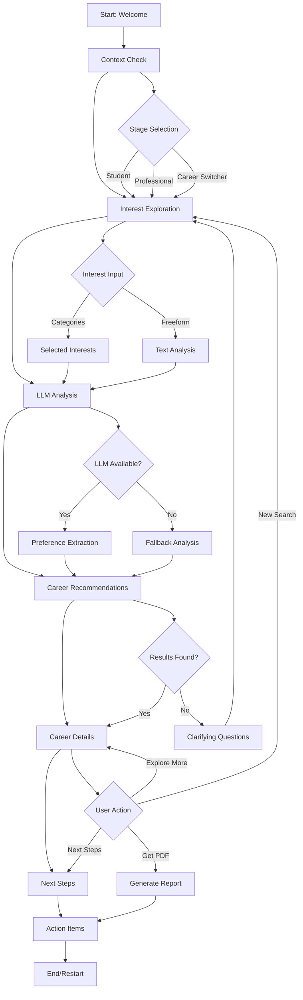

# Career Discovery Chatbot - Technical Documentation

## Table of Contents
1. [Project Overview](#project-overview)
2. [System Architecture](#system-architecture)
3. [Conversational Flow](#conversational-flow)
4. [Technical Implementation](#technical-implementation)
5. [API Documentation](#api-documentation)
6. [Database Schema](#database-schema)
7. [Deployment Guide](#deployment-guide)
8. [Troubleshooting](#troubleshooting)

---

## Project Overview

### Description
The Career Discovery Chatbot is an intelligent, AI-powered system designed to help users discover suitable career paths through interactive conversations. The system leverages advanced language models, vector databases, and prompt engineering to provide personalized career recommendations.

### Key Features
- **Intelligent Conversation Flow**: Multi-stage conversation with adaptive questioning
- **Vector-based Career Matching**: Semantic search using ChromaDB and sentence transformers
- **LLM-powered Analysis**: Groq and Mixtral integration for preference extraction and explanations
- **Personalized Recommendations**: Context-aware career suggestions with detailed explanations
- **Interactive UI**: Modern Streamlit-based interface with progress tracking

### Technology Stack
- **Frontend**: Streamlit (Python web framework)
- **Backend**: Python 3.12+
- **Vector Database**: ChromaDB with persistent storage
- **LLM Integration**: Groq API with Mixtral models
- **Embedding Model**: Sentence Transformers (all-MiniLM-L6-v2)
- **Data Processing**: Pandas, NumPy
- **Prompt Management**: Template-based system with modular prompts

---

## System Architecture

### High-Level Architecture
```
┌─────────────────┐    ┌─────────────────┐    ┌─────────────────┐
│   Streamlit UI  │───▶│  Core Engine    │───▶│   Data Layer    │
│                 │    │                 │    │                 │
│ - Chat Interface│    │ - Flow Manager  │    │ - ChromaDB      │
│ - Career Cards  │    │ - LLM Manager   │    │ - Career Data   │
│ - Progress UI   │    │ - Counselor     │    │ - Embeddings    │
└─────────────────┘    └─────────────────┘    └─────────────────┘
         │                       │                       │
         ▼                       ▼                       ▼
┌─────────────────┐    ┌─────────────────┐    ┌─────────────────┐
│   Components    │    │   External APIs │    │   Prompt System │
│                 │    │                 │    │                 │
│ - chat_interface│    │ - Groq API      │    │ - Templates     │
│ - career_cards  │    │ - Sentence      │    │ - Categories    │
│ - option_selector│   │   Transformers  │    │ - Fallbacks     │
└─────────────────┘    └─────────────────┘    └─────────────────┘
```

### Component Overview

#### Frontend Layer (Streamlit UI)
- **Main App** (`app.py`): Entry point and application orchestration
- **Chat Interface** (`components/chat_interface.py`): Conversational UI and flow management
- **Career Cards** (`components/career_cards.py`): Career display components
- **Option Selector** (`components/option_selector.py`): Interactive selection widgets

#### Core Engine Layer
- **Flow Manager** (`core/flow_manager.py`): Conversation state and flow control
- **Career Counselor** (`core/career_counselor.py`): Main business logic and orchestration
- **LLM Manager** (`core/llm_manager.py`): Language model integration and prompt handling
- **Chroma Manager** (`core/chroma_manager.py`): Vector database operations

#### Data Layer
- **Career Data** (`data/career_data.json`): Structured career information (109 careers)
- **Vector Database** (`chroma_db/`): Persistent ChromaDB storage with embeddings
- **Career Embeddings** (`data/career_embeddings.py`): Embedding generation and management

#### Prompt System
- **Preference Extraction** (`prompts/preference_extraction/`): Interest, skill, and value analysis
- **Career Mapping** (`prompts/career_mapping/`): Domain-specific career matching
- **Explanation Generation** (`prompts/explanation_generation/`): Personalized explanations
- **Fallback Handling** (`prompts/fallback/`): Clarifying questions and error recovery

---

## Conversational Flow

### Complete Flow Diagram


### Detailed Stage Breakdown

#### Stage 1: Welcome & Onboarding
**Purpose**: Introduction and user engagement
**Duration**: 30 seconds
**Components**:
- Welcome message with AI persona introduction
- Progress indicator (0/9 steps)
- Call-to-action buttons

**Code Location**: `components/chat_interface.py:display_welcome_message()`

**UI Elements**:
```python
st.markdown("### 👋 Hey there! I'm *Brainy*, your AI Career Guide.")
st.progress(0, text="0/9 Steps")
# Two-column button layout
```

#### Stage 2: Context & Confidence Check
**Purpose**: Understand user's current career stage
**Duration**: 1 minute
**Options**: Student, College Student, Working Professional, Career Switcher

**Code Location**: `components/chat_interface.py:display_context_check()`

**Business Logic**:
```python
# Stores user stage for personalized questioning
st.session_state.user_data['current_stage'] = selected_option
# Triggers flow to interest exploration
st.session_state.conversation_flow = 'interest_exploration'
```

#### Stage 3: Interest Exploration
**Purpose**: Capture user interests and preferences
**Duration**: 2-3 minutes
**Input Methods**:
1. **Category Selection**: Predefined interest categories
2. **Freeform Input**: Open-text description

**Code Location**: `components/chat_interface.py:display_interest_exploration()`

**Categories Available**:
- Technology & Innovation
- Healthcare & Medicine
- Business & Entrepreneurship
- Creative Arts & Design
- Education & Teaching
- Science & Research
- Sports & Fitness
- Social Impact & Service

**Data Collection**:
```python
selected_interests = st.multiselect("Pick your interest areas:")
freeform_interests = st.text_area("Tell me more about your interests:")
```

#### Stage 4: LLM-Powered Analysis
**Purpose**: Extract structured preferences using AI
**Duration**: 30 seconds (processing)
**LLM Models**: Groq Mixtral-8x7b-32768

**Code Location**: `core/llm_manager.py:extract_preferences()`

**Analysis Components**:
1. **Interest Analysis**: Categorize and weight interests
2. **Skill Assessment**: Identify mentioned or implied skills
3. **Value Identification**: Extract work values and motivations
4. **Confidence Scoring**: Assess information completeness

**Prompt Templates**:
- `prompts/preference_extraction/interest_extraction.txt`
- `prompts/preference_extraction/skill_assessment.txt`
- `prompts/preference_extraction/values_identification.txt`

**Output Structure**:
```json
{
    "primary_interests": ["technology", "problem-solving"],
    "skills": ["programming", "analytical thinking"],
    "values": ["innovation", "work-life balance"],
    "confidence_level": "high",
    "missing_info": []
}
```

#### Stage 5: Career Matching & Recommendations
**Purpose**: Generate personalized career recommendations
**Duration**: 1-2 seconds
**Matching Methods**:
1. **LLM-based Mapping**: Intelligent career suggestion using prompts
2. **Vector Search Fallback**: Semantic similarity search

**Code Location**: `core/llm_manager.py:map_careers_to_preferences()`

**LLM Career Mapping Process**:
```python
# Domain-specific prompts for different career areas
prompt_files = {
    'stem': 'prompts/career_mapping/stem_careers.txt',
    'arts': 'prompts/career_mapping/arts_careers.txt',
    'sports': 'prompts/career_mapping/sports_careers.txt',
    'general': 'prompts/career_mapping/general_mapping.txt'
}
```

**Vector Search Fallback**:
```python
# If LLM unavailable, use semantic search
query = " ".join(primary_interests + keywords)
results = counselor.search_career_data(query, top_k=5)
```

**Recommendation Scoring**:
- Interest alignment: 40%
- Skill match: 30%
- Value compatibility: 20%
- Growth potential: 10%

#### Stage 6: Career Detail Exploration
**Purpose**: Deep dive into recommended careers
**Duration**: 3-5 minutes per career
**Information Provided**:

**Career Card Structure**:
```python
career_info = {
    'title': str,
    'description': str,
    'industry': str,
    'skills': List[str],
    'education': List[str],
    'salary_range': str,
    'job_outlook': str,
    'companies': List[str],
    'career_paths': List[str],
    'personality_match': List[str],
    'llm_explanation': str  # Personalized explanation
}
```

**UI Components**:
- Career title with emoji
- Personalized explanation (LLM-generated)
- Skills breakdown with formatting
- Education requirements
- Salary expectations
- Top companies
- Career progression path
- Personality fit indicators

#### Stage 7: Next Steps & Action Planning
**Purpose**: Provide actionable guidance
**Duration**: 2-3 minutes
**Components**:
1. **Immediate Actions**: Skills to develop, courses to take
2. **Resource Links**: Educational platforms, job boards
3. **Timeline Planning**: Short-term and long-term goals
4. **PDF Report Generation**: Comprehensive career summary

---

## Technical Implementation

### Core Classes and Methods

#### CareerCounselor Class
**File**: `core/career_counselor.py`

**Key Methods**:
```python
class CareerCounselor:
    def __init__(self):
        """Initialize with Groq client, ChromaDB, and LLM manager"""
        
    def search_career_data(self, query: str, top_k: int = 5) -> List[Dict]:
        """Vector-based career search using embeddings"""
        
    def generate_contextual_response(self, user_input: str, 
                                   conversation_context: str, 
                                   flow_stage: str) -> str:
        """Generate contextual responses using Groq LLM"""
        
    def populate_career_database(self, career_data_list: List[Dict]) -> bool:
        """Populate ChromaDB with career information"""
```

#### LLMManager Class
**File**: `core/llm_manager.py`

**Key Methods**:
```python
class LLMManager:
    def extract_preferences(self, conversation_history: str) -> Dict:
        """Extract structured preferences from conversation"""
        
    def map_careers_to_preferences(self, preferences: Dict) -> List[str]:
        """Map preferences to specific career recommendations"""
        
    def generate_career_explanation(self, career: Dict, preferences: Dict) -> str:
        """Generate personalized career explanations"""
        
    def generate_clarifying_questions(self, context: str) -> List[str]:
        """Generate follow-up questions for better recommendations"""
```

#### ChromaManager Class
**File**: `core/chroma_manager.py`

**Key Methods**:
```python
class ChromaManager:
    def get_or_create_collection(self) -> chromadb.Collection:
        """Initialize or retrieve ChromaDB collection"""
        
    def search_careers(self, query: str, top_k: int = 5) -> List[Dict]:
        """Text-based career search"""
```

### Data Models

#### Career Data Schema
**File**: `data/career_data.json`

```json
{
    "id": "unique_career_id",
    "title": "Career Title",
    "description": "Detailed career description",
    "industry": "Industry category",
    "skills": ["skill1", "skill2", "skill3"],
    "education": ["education_requirement1", "education_requirement2"],
    "salary_range": "$X,000 - $Y,000",
    "job_outlook": "Growth projection",
    "personality_match": ["trait1", "trait2"],
    "companies": ["company1", "company2"],
    "career_paths": ["path1", "path2", "path3"],
    "tagline": "Brief catchy description",
    "emoji": "🚀"
}
```

#### User Session State
```python
st.session_state.user_data = {
    'current_stage': str,           # User's career stage
    'selected_interests': List[str], # Chosen interest categories
    'freeform_interests': str,      # Open-text interests
    'llm_analysis': Dict,           # Structured preferences
    'recommended_careers': List[Dict], # Career recommendations
    'selected_career_id': str       # Currently viewed career
}

st.session_state.conversation_flow = str  # Current flow stage
```

### Vector Database Implementation

#### ChromaDB Configuration
```python
# Persistent storage configuration
client = chromadb.PersistentClient(path="./chroma_db")
collection = client.create_collection(
    name="career-discovery-collection",
    metadata={"hnsw:space": "cosine"}  # Cosine similarity
)
```

#### Embedding Generation
**Model**: `all-MiniLM-L6-v2` (384 dimensions)
**Input Text Composition**:
```python
text_to_embed = f"{career['title']} {career['description']} " \
                f"{' '.join(career['skills'])} {career['industry']}"
```

#### Metadata Handling
**ChromaDB Compatibility**: Lists converted to comma-separated strings
```python
safe_metadata = {}
for key, value in career.items():
    if isinstance(value, list):
        safe_metadata[key] = ', '.join(str(item) for item in value)
    else:
        safe_metadata[key] = value
```

### Prompt Engineering System

#### Template Structure
**Base Directory**: `prompts/`

**Categories**:
1. **Preference Extraction** (`preference_extraction/`)
   - `interest_extraction.txt`: Analyze and categorize interests
   - `skill_assessment.txt`: Identify skills and competencies
   - `values_identification.txt`: Extract work values and motivations

2. **Career Mapping** (`career_mapping/`)
   - `stem_careers.txt`: STEM field recommendations
   - `arts_careers.txt`: Creative and artistic careers
   - `sports_careers.txt`: Sports and fitness careers
   - `general_mapping.txt`: Cross-domain career mapping

3. **Explanation Generation** (`explanation_generation/`)
   - `career_explanation.txt`: Personalized career explanations

4. **Fallback Handling** (`fallback/`)
   - `clarifying_questions.txt`: Generate follow-up questions

#### Prompt Template Format
```text
# Role Definition
You are an expert career counselor with deep knowledge of various industries and career paths.

# Context
{context_variables}

# Task
{specific_task_description}

# Output Format
{expected_output_structure}

# Examples
{few_shot_examples}
```

### Error Handling and Resilience

#### LLM Fallback Strategy
```python
def get_career_recommendations(self, preferences):
    try:
        # Primary: LLM-based recommendations
        return self.llm_manager.map_careers_to_preferences(preferences)
    except Exception as llm_error:
        logger.warning(f"LLM failed: {llm_error}")
        # Fallback: Vector search
        return self.vector_search_careers(preferences)
```

#### PyTorch Conflict Resolution
**Environment Variables**:
```bash
export TOKENIZERS_PARALLELISM=false
export OMP_NUM_THREADS=1
```

**Lazy Loading Pattern**:
```python
@st.cache_resource
def get_embedding_model():
    """Lazy load embedding model to avoid conflicts"""
    from sentence_transformers import SentenceTransformer
    return SentenceTransformer('all-MiniLM-L6-v2')
```

---

## API Documentation

### Internal API Endpoints

#### Career Search API
**Method**: `POST /api/search`
**Input**:
```json
{
    "query": "software development python",
    "top_k": 5,
    "filters": {
        "industry": "Technology",
        "salary_min": 70000
    }
}
```

**Output**:
```json
{
    "results": [
        {
            "career": { /* career object */ },
            "score": 0.85,
            "explanation": "Matches your interest in..."
        }
    ],
    "total_found": 15
}
```

#### Preference Extraction API
**Method**: `POST /api/extract_preferences`
**Input**:
```json
{
    "conversation_history": "I love coding and solving problems...",
    "user_stage": "College Student"
}
```

**Output**:
```json
{
    "preferences": {
        "primary_interests": ["technology", "problem-solving"],
        "skills": ["programming", "analytical thinking"],
        "values": ["innovation", "growth"],
        "confidence_level": "high"
    }
}
```

### External API Integration

#### Groq API Configuration
**Model**: `mixtral-8x7b-32768`
**Parameters**:
```python
groq_params = {
    "model": "mixtral-8x7b-32768",
    "temperature": 0.7,
    "max_tokens": 1000,
    "top_p": 0.9
}
```

**Rate Limits**: 100 requests/minute (free tier)
**Error Handling**: Exponential backoff with 3 retries

#### Sentence Transformers Integration
**Model**: `all-MiniLM-L6-v2`
**Specifications**:
- Embedding dimension: 384
- Max sequence length: 512 tokens
- Performance: ~500 sentences/second

---

## Database Schema

### ChromaDB Collections

#### Career Collection Schema
**Collection Name**: `career-discovery-collection`
**Similarity Metric**: Cosine similarity

**Document Structure**:
```python
{
    "id": "career_unique_id",
    "document": "searchable_text_representation",
    "metadata": {
        "title": str,
        "industry": str,
        "skills": str,  # Comma-separated
        "education": str,  # Comma-separated
        "salary_range": str,
        "job_outlook": str,
        "companies": str,  # Comma-separated
        "career_paths": str,  # Comma-separated
        "personality_match": str,  # Comma-separated
        "description": str,
        "tagline": str,
        "emoji": str
    },
    "embedding": List[float]  # 384-dimensional vector
}
```

#### Session Storage Schema
**Streamlit Session State**:
```python
{
    "user_data": {
        "current_stage": str,
        "selected_interests": List[str],
        "freeform_interests": str,
        "llm_analysis": {
            "primary_interests": List[str],
            "skills": List[str],
            "values": List[str],
            "confidence_level": str,
            "missing_info": List[str]
        },
        "recommended_careers": List[Dict],
        "selected_career_id": str,
        "conversation_history": List[Dict]
    },
    "conversation_flow": str,
    "ui_state": {
        "progress_step": int,
        "current_page": str
    }
}
```

---

## Deployment Guide

### Prerequisites
**System Requirements**:
- Python 3.12+
- 4GB RAM minimum
- 2GB disk space
- Internet connection for API calls

**API Keys Required**:
- Groq API key (free tier available)

### Installation Steps

#### 1. Clone and Setup
```bash
git clone <repository_url>
cd career_chatbot
python -m venv venv
source venv/bin/activate  # Linux/Mac
# venv\Scripts\activate    # Windows
```

#### 2. Install Dependencies
```bash
pip install -r requirements.txt
```

#### 3. Environment Configuration
Create `.env` file:
```env
GROQ_API_KEY=your_groq_api_key_here
EMBEDDING_MODEL=all-MiniLM-L6-v2
```

#### 4. Database Initialization
```bash
python data/career_embeddings.py
```

#### 5. Application Launch
```bash
export TOKENIZERS_PARALLELISM=false
export OMP_NUM_THREADS=1
streamlit run app.py
```

### Production Deployment

#### Docker Configuration
**Dockerfile**:
```dockerfile
FROM python:3.12-slim

WORKDIR /app
COPY requirements.txt .
RUN pip install -r requirements.txt

COPY . .
EXPOSE 8501

ENV TOKENIZERS_PARALLELISM=false
ENV OMP_NUM_THREADS=1

CMD ["streamlit", "run", "app.py", "--server.port=8501", "--server.address=0.0.0.0"]
```

#### Kubernetes Deployment
**deployment.yaml**:
```yaml
apiVersion: apps/v1
kind: Deployment
metadata:
  name: career-chatbot
spec:
  replicas: 2
  selector:
    matchLabels:
      app: career-chatbot
  template:
    metadata:
      labels:
        app: career-chatbot
    spec:
      containers:
      - name: career-chatbot
        image: career-chatbot:latest
        ports:
        - containerPort: 8501
        env:
        - name: GROQ_API_KEY
          valueFrom:
            secretKeyRef:
              name: api-secrets
              key: groq-api-key
```

#### Cloud Deployment Options

**Streamlit Cloud**:
1. Push to GitHub repository
2. Connect Streamlit Cloud account
3. Deploy directly from repository
4. Add secrets in Streamlit Cloud dashboard

**AWS EC2**:
```bash
# Launch EC2 instance (t3.medium recommended)
# Configure security groups (port 8501)
# Install application using installation steps
# Set up reverse proxy with nginx
```

**Google Cloud Run**:
```bash
gcloud run deploy career-chatbot \
  --source . \
  --platform managed \
  --port 8501 \
  --memory 2Gi
```

### Performance Optimization

#### Caching Strategy
```python
# Cache embedding model
@st.cache_resource
def load_embedding_model():
    return SentenceTransformer('all-MiniLM-L6-v2')

# Cache career data
@st.cache_data
def load_career_data():
    with open('data/career_data.json') as f:
        return json.load(f)
```

#### Resource Management
- **Memory**: 2-4GB recommended for production
- **CPU**: 2 cores minimum for concurrent users
- **Storage**: Persistent volume for ChromaDB data

---

## Troubleshooting

### Common Issues and Solutions

#### 1. PyTorch/Streamlit Conflicts
**Symptoms**: Event loop errors, torch._classes issues
**Solution**:
```bash
export TOKENIZERS_PARALLELISM=false
export OMP_NUM_THREADS=1
```

#### 2. ChromaDB Metadata Errors
**Symptoms**: "Metadata must be dict of str: str|int|float|bool"
**Solution**: Ensure list metadata is converted to strings
```python
if isinstance(value, list):
    safe_metadata[key] = ', '.join(str(item) for item in value)
```

#### 3. Groq API Rate Limits
**Symptoms**: HTTP 429 errors
**Solution**: Implement exponential backoff
```python
import time
import random

def retry_with_backoff(func, max_retries=3):
    for attempt in range(max_retries):
        try:
            return func()
        except Exception as e:
            if attempt == max_retries - 1:
                raise e
            wait_time = (2 ** attempt) + random.uniform(0, 1)
            time.sleep(wait_time)
```

#### 4. Embedding Model Loading Issues
**Symptoms**: CUDA errors, model download failures
**Solution**: Force CPU usage and manual model download
```python
import os
os.environ['CUDA_VISIBLE_DEVICES'] = ''

# Manual model download if needed
from huggingface_hub import snapshot_download
snapshot_download(repo_id="sentence-transformers/all-MiniLM-L6-v2")
```

#### 5. Memory Issues
**Symptoms**: Out of memory errors, slow performance
**Solution**: Batch processing and model optimization
```python
# Process careers in batches
batch_size = 50
for i in range(0, len(careers), batch_size):
    batch = careers[i:i + batch_size]
    process_batch(batch)
```

### Debugging Tools

#### Logging Configuration
```python
import logging

logging.basicConfig(
    level=logging.INFO,
    format='%(asctime)s - %(name)s - %(levelname)s - %(message)s',
    handlers=[
        logging.FileHandler('career_chatbot.log'),
        logging.StreamHandler()
    ]
)
```

#### Health Check Endpoint
```python
def health_check():
    """Verify system components are working"""
    checks = {
        'chromadb': test_chromadb_connection(),
        'groq_api': test_groq_api(),
        'embedding_model': test_embedding_model(),
        'career_data': test_career_data_loading()
    }
    return all(checks.values()), checks
```

### Performance Monitoring

#### Metrics to Track
- Response time per conversation stage
- LLM API call latency
- Vector search performance
- User session duration
- Career recommendation accuracy

#### Monitoring Setup
```python
import time
from functools import wraps

def monitor_performance(func):
    @wraps(func)
    def wrapper(*args, **kwargs):
        start_time = time.time()
        result = func(*args, **kwargs)
        duration = time.time() - start_time
        logger.info(f"{func.__name__} took {duration:.2f} seconds")
        return result
    return wrapper
```

---

## Future Enhancements

### Planned Features
1. **Multi-language Support**: Internationalization with i18n
2. **Voice Interface**: Speech-to-text integration
3. **Resume Analysis**: PDF parsing and skill extraction
4. **Learning Paths**: Integration with online course platforms
5. **Job Market Analytics**: Real-time job market data integration
6. **Personality Assessment**: Integration with career assessment tools

### Technical Improvements
1. **Model Fine-tuning**: Custom embedding models for career domain
2. **Advanced RAG**: Retrieval-Augmented Generation for better responses
3. **A/B Testing**: Conversation flow optimization
4. **Real-time Analytics**: User behavior tracking and optimization
5. **Mobile App**: React Native or Flutter mobile version

---

*This documentation serves as a comprehensive guide for developers, maintainers, and stakeholders working with the Career Discovery Chatbot system.*
